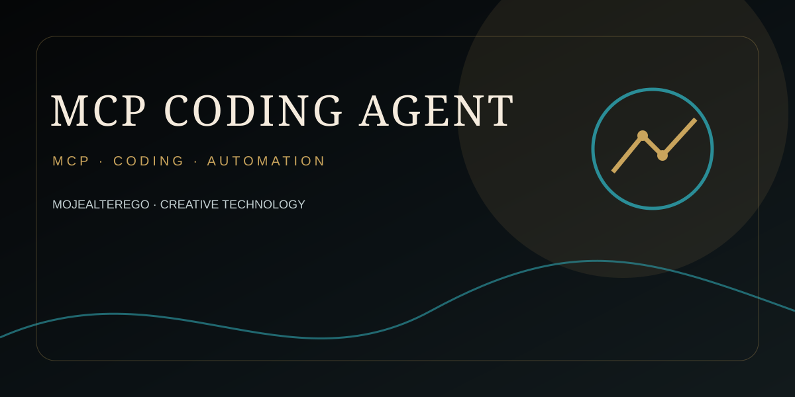

<div align="center">



</div>

---

# MCP Coding Agent — Autonomous Agents Builder

Autonomous AI engineering system exposed through Model Context Protocol (MCP). The Builder is designed to create production software, individual agents, and complete multi-agent systems.

## What this is

This repository is not a simple chatbot or prompt wrapper. It is the foundation of an **Agents Builder**: a system whose job is to analyze an engineering request, design the required architecture, create or select specialist agents, execute implementation work, validate the result, repair failures, and finalize only when verification evidence exists.

## Architecture

The runtime uses a manager-style orchestrator with specialist agents for architecture, planning, coding, review, QA, debugging, security, and DevOps. The OpenAI Agents SDK provides the agent runtime and agent-as-tools orchestration; MCP provides interoperability with MCP hosts. citeturn601879search1turn601879search5

## Core lifecycle

```text
requirements
   ↓
analysis
   ↓
architecture
   ↓
agent decomposition
   ↓
implementation plan
   ↓
implementation
   ↓
tests
   ↓
review / diagnosis
   ↓
repair
   ↓
security review
   ↓
integration verification
   ↓
finalize
```

The Builder is designed to handle both:

- a single coding agent or specialist;
- a complete multi-agent system with explicit responsibilities, tools, handoffs, state and verification gates.

## Built-in specialist roles

- System Architect
- Implementation Planner
- Senior Coding Agent
- Code Reviewer
- QA Engineer
- Debugging and Repair Agent
- Security Engineer
- DevOps Engineer

The architecture deliberately uses **manager-as-controller + agents-as-tools** for global coordination, while the runtime also contains dynamic agent graph materialization for systems defined from typed specifications.

## MCP surface

### Builder

- `run_builder`
- `validate_agent_system`
- `generate_agent_system`
- `create_build_state`
- `get_build_state`

### Design

- `create_build_plan`
- `design_agent`
- `design_multi_agent_system`
- `get_builder_architecture`

### Coding / workspace

- `inspect_workspace`
- `read_project_file`
- `write_project_file`
- `execute_workspace_command`
- `inspect_git_status`
- `inspect_git_diff`

### Resources

- `builder://capabilities`
- `builder://tool-policy`

## MCP server

The server exposes MCP over **Streamable HTTP**. The official MCP Python SDK provides an ASGI application with the standard `/mcp` endpoint, and this project adds `/health` as an unauthenticated deployment health check. citeturn601879search6

Start locally:

```bash
python -m venv .venv
source .venv/bin/activate
pip install -e .
pytest
ruff check src tests
mcp-coding-agent
```

Endpoints:

```text
MCP:    http://127.0.0.1:8000/mcp
Health: http://127.0.0.1:8000/health
```

For model execution, configure `OPENAI_API_KEY`. The OpenAI Agents SDK documents `openai-agents` as the installation package and `OPENAI_API_KEY` as the default credential source. citeturn601879search0turn601879search8

## Remote MCP authentication

Set `MCP_AUTH_TOKEN` for a remote deployment. When present, requests to `/mcp` must send:

```text
Authorization: Bearer <MCP_AUTH_TOKEN>
```

The `/health` endpoint remains reachable without the token so a platform health checker can probe service availability.

## Workspace safety

Workspace operations require an explicit project root. Relative paths are resolved and checked so a task cannot escape that root using `..` or symlinks resolved outside the workspace. Command execution is bounded, blocks high-risk binaries, and strips common API/cloud credentials from child processes.

For stronger isolation, the OpenAI Agents SDK also provides Sandbox Agents and Docker-backed sandbox execution patterns. citeturn601879search2

## Deployment

The repository includes:

- `Dockerfile`
- `railway.json`
- `Procfile`
- GitHub Actions CI

The container listens on port `8000`. Railway is configured to use the Dockerfile and `/health` as the service health check.

## Configuration

See `.env.example` for the runtime contract:

```text
OPENAI_API_KEY
OPENAI_MODEL
MCP_HOST
MCP_PORT
MCP_AUTH_TOKEN
BUILDER_MAX_REPAIR_CYCLES
BUILDER_COMMAND_TIMEOUT
BUILDER_STATE_DIR
```

## Validation

CI runs:

```bash
ruff check src tests
pytest -q
```

A local service smoke test is available as:

```bash
python scripts/smoke_test.py
```

A live HTTP smoke test must be run while the server is running. The repository is prepared for CI verification, but this ChatGPT session does not have an active checkout/runtime in which to claim that the tests were executed successfully.

## Current implementation status

This repository now contains the executable architectural core of the autonomous Agents Builder and its MCP server:

- typed agent/system contracts;
- specialist-agent library;
- manager-style orchestration with agents-as-tools;
- dynamic agent graph materialization;
- adaptive implementation planning;
- bounded repair loop;
- workspace-scoped filesystem and command execution;
- Git inspection;
- portable agent-system generation;
- durable JSON build state;
- MCP tools/resources;
- Streamable HTTP MCP server;
- `/health` deployment endpoint;
- optional Bearer authentication;
- Docker packaging;
- Railway deployment configuration;
- GitHub Actions CI;
- unit/contract tests and HTTP smoke test.

Production hardening still belongs behind explicit adapters: isolated container/VM execution for untrusted generated code, richer external persistence, GitHub write operations with dedicated credentials and approvals, deployment-provider adapters, and end-to-end tests against the exact production MCP host.
